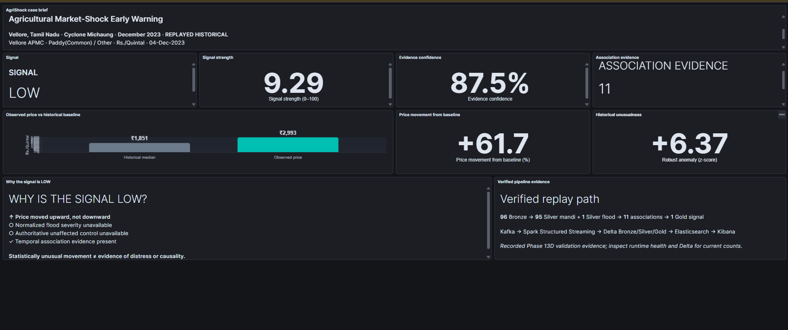
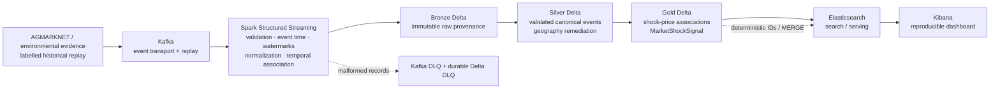

# AgriShock

**An event-time streaming data platform that associates agricultural market prices with environmental evidence to surface and explain unusual market-price movements and potential distress-sale signals.**

> AgriShock produces observational market-shock signals—not causal findings. It does not prove farmer distress, flood impact, or trader misconduct.



## Why AgriShock?

Agricultural prices, weather observations, and flood evidence commonly arrive through disconnected systems, at different times, and with incompatible geographic identifiers. AgriShock treats that as a data-engineering problem: it validates and normalizes source events, preserves provenance, and associates them using event time and authoritative geographic context.

The result is an explainable early-warning indicator. A signal can be LOW or have insufficient evidence; that is useful information, not a failure.

## Architecture



Kafka decouples source/replay producers from consumers. Spark owns the streaming transformations; Delta preserves Bronze → Silver → Gold lineage; Elasticsearch and Kibana serve the resulting signal. See the concise [architecture guide](docs/architecture.md) and detailed [medallion contract](docs/medallion-architecture.md).

## What makes this a data-engineering project?

- Kafka topic design, producer retries, offsets, replay, and dead-letter flow.
- Spark Structured Streaming with explicit schemas, event time, watermarks, deduplication, and temporal association.
- Canonical geographic IDs and remediation for unresolved mappings—never guessed market/district joins.
- Delta Bronze/Silver/Gold layers with provenance, deterministic identities, targeted schema evolution, replay-safe MERGE, and checkpoints.
- Historical median/MAD baselines, robust anomaly evidence, transparent component scoring, and separate signal strength/confidence.
- Idempotent Elasticsearch documents, version-controlled Kibana provisioning, replay/failure contracts, and automated tests.

## Real historical validation

The first bounded validation case is **Cyclone Michaung / Vellore, Tamil Nadu / December 2023**. It uses preserved official AGMARKNET reports and NRSC/NDEM evidence, replayed through the platform—it was not running live in December 2023.

| Evidence | Verified value |
|---|---|
| Location / environmental evidence | Vellore, Tamil Nadu · NRSC/NDEM district-reported evidence, 03–07 Dec 2023 |
| Market series | Vellore APMC · Paddy(Common) · `Other` variety · Rs./Quintal |
| Historical baseline | 22 observations, 01–31 Dec 2022 · median ₹1,851 · MAD 121 |
| Target observation | 04 Dec 2023 · modal price ₹2,993 |
| Unusual movement | +61.6964% from baseline · robust z-score +6.3659 |
| Verified associations | 11 distinct shock-price associations |
| Final signal | **LOW** · 9.29 / 100 strength · 87.5% data confidence |
| Control / provenance | No authoritative unaffected control · `replayed_historical` |

The observed movement was statistically unusual but **positive**, not a price decline. The 144 ha NRSC/NDEM observation is source evidence, not a normalized severity score; there is also no authoritative control market. The conservative LOW result is therefore correct and intentional. Read the full [real-case evidence and limitations](docs/phase-13d-real-analytics.md).

## Dashboard

The primary Kibana dashboard is version-controlled and pins both `fixture_kind: replayed_historical` and the deterministic Vellore signal ID, so the existing synthetic smoke record cannot appear as real evidence. It shows the case, LOW status, confidence, observed-versus-baseline comparison, anomaly evidence, interpretation, and verified pipeline path.

The hero image above is a genuine local Kibana capture of the pinned
replayed-historical Vellore case. Its capture constraints and provenance are
documented in [docs/images/README.md](docs/images/README.md).

Provision locally:

```powershell
python scripts/provision_kibana_dashboard.py --validate-only
python scripts/provision_kibana_dashboard.py --url http://localhost:5601 --dark-appearance
```

Open <http://localhost:5601> and select **AgriShock — Vellore real historical case**. See the [dashboard walkthrough](docs/phase-14-dashboard-demo.md).

## Quick start

### Prerequisites

- Python 3.11
- Java 17
- Docker Desktop with WSL2 integration (recommended Spark runtime)
- Docker Compose

Clone the repository, then from its root:

```powershell
python -m venv .venv
.\.venv\Scripts\Activate.ps1
python -m pip install --upgrade pip
python -m pip install -e ".[dev,streaming]"
Copy-Item .env.example .env
docker compose up -d kafka kafka-init elasticsearch kibana
docker compose ps
```

For the supported end-to-end synthetic contract path, follow the exact [runtime validation runbook](docs/runtime-validation.md): it prepares local reference dimensions, starts Spark in WSL2, publishes labelled synthetic events, materializes Gold, verifies Delta/Elasticsearch, and opens Kibana.

The bounded real case requires local, gitignored raw official exports and reference artifacts; they are deliberately **not** bundled. Its acquisition, geography, and replay constraints are documented in [data sources](docs/data-sources.md) and the [real-case study](docs/phase-13d-real-analytics.md). Do not treat the synthetic smoke path as real historical evidence.

## Testing

```powershell
python -m pytest -q
python -m compileall src tests
git diff --check
```

The current suite contains **112 tests** spanning schema/data-quality, analytics, replay/idempotency, failure contracts, runtime helpers, and Kibana saved-object validation. CI runs the unit/data-quality/chaos-safe contract suite; live Kafka/Spark/Delta/Elasticsearch validation is documented separately.

## Project structure

```text
src/agri_shock/       streaming, ingestion, geospatial, analytics, storage, serving
config/               runtime and policy configuration examples
data/case_studies/    bounded, versioned case reference metadata
dashboards/kibana/    reproducible Kibana saved objects and provisioning notes
docs/                 architecture, operations, methodology, case evidence, guides
scripts/              Kafka bootstrap and Kibana provisioning
tests/                unit, data-quality, integration-contract, and chaos tests
```

## Scientific scope and limitations

- A market-shock signal is observational evidence, not causal proof.
- The first real validation is one bounded historical replay, not continuous production operation in December 2023.
- The Vellore association is district-reported; its administrative boundary is not a flood footprint.
- The case has no authoritative unaffected control market.
- Price varieties and incompatible units are not pooled.

## Explore further

- [Architecture](docs/architecture.md)
- [Real historical case study](docs/phase-13d-real-analytics.md)
- [Kibana dashboard and walkthrough](docs/phase-14-dashboard-demo.md)
- [Demo guide](docs/demo-guide.md)
- [Interview preparation](docs/interview-guide.md)
- [Reliability and replay](docs/reliability-and-replay.md)
- [Data sources and acquisition constraints](docs/data-sources.md)
- [Runtime validation](docs/runtime-validation.md)
- [Engineering decisions](docs/engineering-decisions.md)
- [Limitations](docs/limitations.md)

## License

AgriShock source code and repository-authored documentation are licensed under
the [MIT License](LICENSE). This license does not override the terms,
provenance requirements, or redistribution restrictions of third-party source
data, official reports, or external documentation; consult each source's own
terms before reuse.
