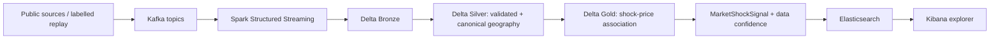

# AgriShock

AgriShock is a portfolio-grade, event-time data platform for investigating
whether an environmental shock is followed by an unusual local mandi price
movement relative to a historical baseline and comparable markets. Its output
is a transparent **market shock signal**, never a causal finding.

## Scientific limitation

An alert is an explainable risk signal, not proof that weather or flooding
caused a price movement, farmer distress, or trader misconduct. Correlation is
not causation.

## Status

Phase 7 recruiter demo assets and Elasticsearch delivery contract are complete.
Docker is not installed on this host, so Docker, Kafka, Spark, Elasticsearch,
and Kibana have not been run here.
See [data-source feasibility](docs/data-sources.md).

## Architecture



The demo fixture starts at the Gold-to-Elasticsearch boundary when a full
source/Spark runtime is unavailable. It is explicitly marked synthetic and is
not a substitute for source-attributed records.

The physical Delta lineage, deterministic keys, replay behavior, and schema
evolution policy are described in [the medallion architecture](docs/medallion-architecture.md).

## Quick start (foundation)

```powershell
python -m venv .venv
.\.venv\Scripts\Activate.ps1
python -m pip install -e ".[dev]"
python -m pytest
```

Copy `.env.example` to `.env` before configuring source credentials. Do not
commit `.env`.

## Project conventions

- Event time and ingestion time are distinct required fields.
- Invalid events are designed to become DLQ records with an explicit reason.
- Replayed historical data and synthetic failure tests are labelled as such.
- Geography is normalized to canonical IDs, not display-name joins.

## Replay mode

Use `python -m agri_shock.ingestion.replay path/to/events.ndjson`. Input must
explicitly use `replayed_historical` or `synthetic_failure_injection` as its
source label; original `event_time` is preserved. The current CLI uses an
in-memory sink for local validation. Kafka delivery requires the optional
`confluent-kafka` runtime dependency and a reachable broker.

## Recruiter demo

Run the [end-to-end demo](docs/demo-runbook.md) to index a multi-state,
synthetic historical-context fixture into Elasticsearch and explore it in
Kibana. It covers Assam and Bihar floods, Kerala flood context, Maharashtra
drought context, and Himachal Pradesh landslide context across ten distinct
district/commodity scenarios. The numbers are intentionally synthetic; see
[fixture provenance](data/sample/README.md).

## Documentation

- [Source validation](docs/data-sources.md)
- [Architecture](docs/architecture.md)
- [Data model](docs/data-model.md)
- [Engineering decisions](docs/engineering-decisions.md)
- [Market shock signal methodology](docs/signal-methodology.md)
- [Recruiter demo runbook](docs/demo-runbook.md)
- [Kibana dashboard specification](dashboards/kibana/README.md)
- [Delta medallion architecture](docs/medallion-architecture.md)
- [Limitations](docs/limitations.md)

## License

To be selected before public publication.
