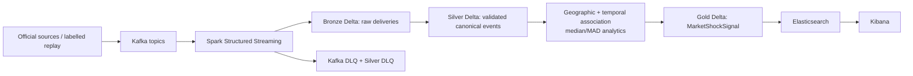

# Architecture

AgriShock separates source acquisition, durable event processing, analytics,
and serving so each stage is inspectable and replayable.

## Responsibilities

| Layer | Responsibility |
|---|---|
| Source adapters | Retrieve public evidence or consume labelled historical replay; attach source metadata and preserve raw artifacts locally. |
| Kafka | Isolate producers from consumers, preserve partitions/offsets, and provide replayable event transport. |
| Spark Structured Streaming | Parse explicit schemas; validate, deduplicate, watermark, normalize IDs, route malformed rows, and perform event-time association. |
| Bronze Delta | Preserve immutable Kafka delivery metadata, raw payload, event time, ingestion time, and provenance for debugging/replay. |
| Silver Delta | Hold validated canonical mandi, environmental, geography/remediation, and durable DLQ records. |
| Gold Delta | Persist shock-price associations and deterministic MarketShockSignal records. |
| Elasticsearch / Kibana | Serve signals through deterministic document IDs and a version-controlled dashboard. |

## Cross-cutting contracts

- **Event time remains distinct from ingestion time.** Association logic and
  watermarks use source event time; ingestion time supports audit and latency
  analysis.
- **Geography is authoritative or unresolved.** Source geometry is associated
  spatially when present; case-scoped official references are explicitly
  bounded. Display-name guessing is not permitted.
- **Failures stay observable.** Spark validation publishes a Kafka DLQ envelope
  and persists the same contract to `silver/dlq_events`.
- **Replays are idempotent within the documented contracts.** Stable event and
  signal IDs, Delta MERGE, checkpoints, and Elasticsearch `_id=signal_id`
  prevent uncontrolled duplicate serving records.
- **Provenance is visible.** Synthetic, replayed-historical, and failure
  injection records remain labelled and cannot be presented interchangeably.

See [the medallion architecture](medallion-architecture.md) for keys,
partitions, schema evolution, and late-data behavior; see
[reliability and replay](reliability-and-replay.md) for operational limits.
